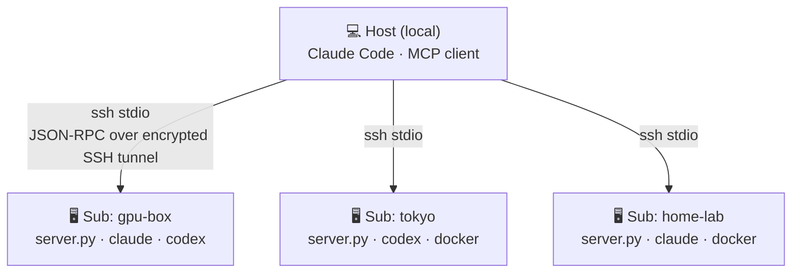
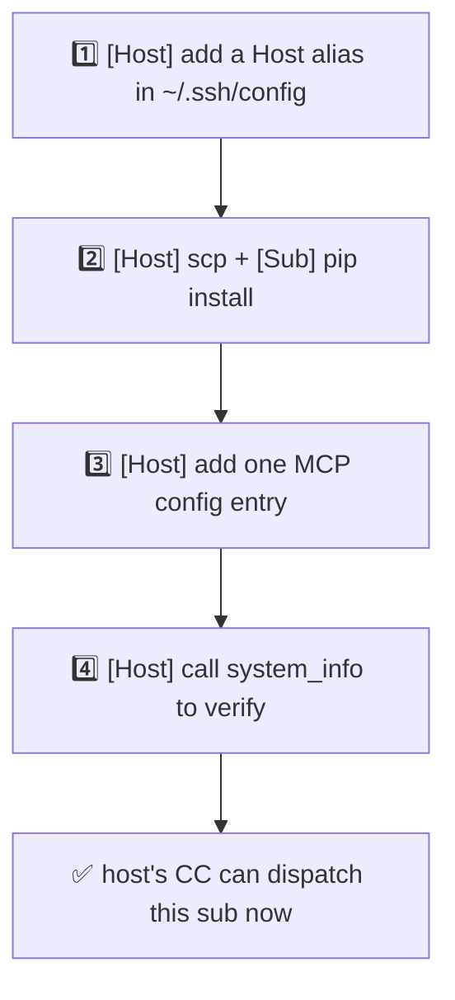
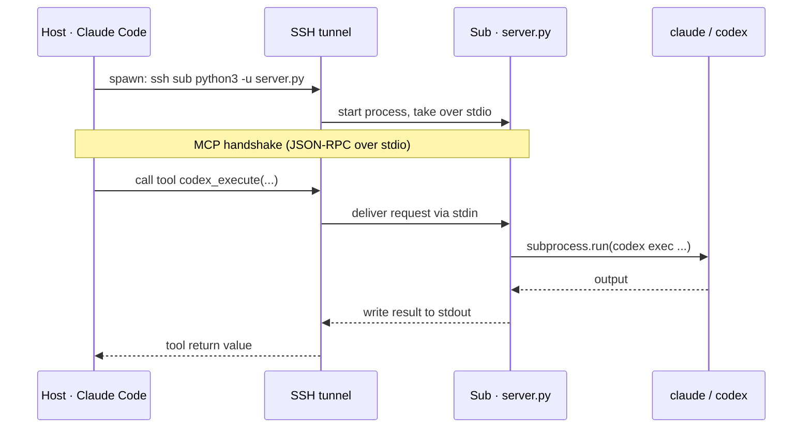
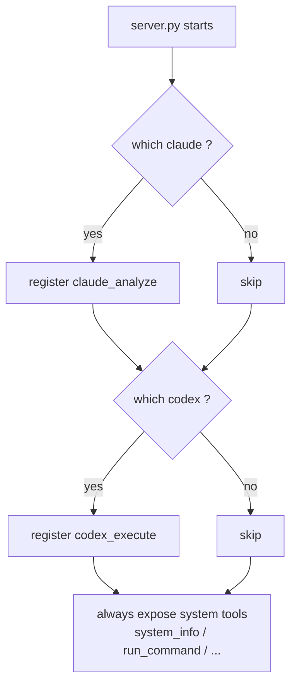
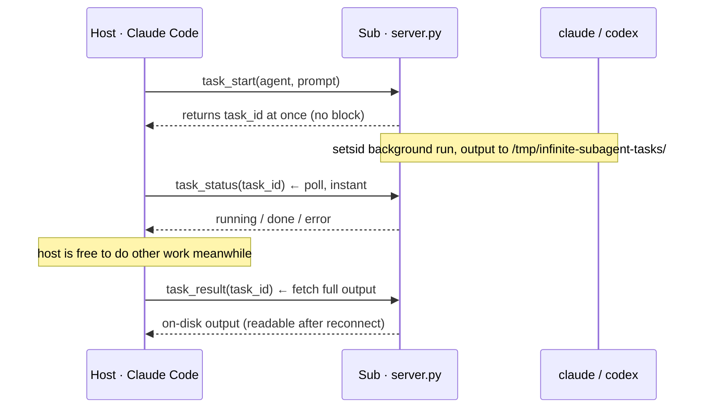

# Infinite Subagent

> Turn any number of remote servers into subagents for your local Claude Code.
> **One Python file. SSH-tunneled MCP. No ports, no HTTP server, no extra network config.**

**[中文](./README.md)** · [Architecture](#-overall-architecture) · [Install](#-install-you-only-do-the-setup-once) · [Add a sub](#-add-a-new-sub) · [How it works](#️-how-it-works) · [Security](#-security) · [Changelog](#-changelog)

**v1.1.0** · 2026-06-17

**Terminology** (every command below is tagged with where it runs):

- **Host**: your **local** machine, runs Claude Code, the **dispatcher**.
- **Sub**: a **remote** server being dispatched, runs `server.py`.

---

## 🎯 How good is it?

You have several machines — cloud boxes, a home GPU rig, overseas VPS — each with different AI CLIs installed (Claude Code, Codex). You want **one local Claude Code to command all of them**, dispatching tasks like subagents in parallel — without wrestling with ports, firewalls, HTTPS, or token servers.

**The solution:** deploy a single `server.py` on each sub. It exposes MCP tools over an **SSH stdio channel**. The host just `ssh`es in; all MCP traffic stays inside the encrypted SSH tunnel.

---

## 🏗️ Overall architecture



Each link is its own SSH tunnel — independent and concurrent. The same `server.py` runs on every sub and auto-exposes a different tool set based on what's installed there. How to wire it up below.

---

## 🚀 Install: you only do the setup once

Worked example: "Host + one sub `myhost`". Fully general — repeat for as many subs as you like.

### 1. SSH trust (Host → Sub)

```bash
# [Host] generate a dedicated key (skip if you already have one)
ssh-keygen -t ed25519 -f ~/.ssh/subagent_ed25519 -N ""

# [Host] push the public key to the sub (asks for the sub's password once)
ssh-copy-id -i ~/.ssh/subagent_ed25519.pub user@myhost

# [Host] add an alias to ~/.ssh/config so you only type myhost
cat >> ~/.ssh/config <<'EOF'
Host myhost
    Hostname 1.2.3.4           # sub's IP / domain / Tailscale address
    User ubuntu                # sub's login user
    IdentityFile ~/.ssh/subagent_ed25519
    IdentitiesOnly yes
    ServerAliveInterval 60
    ControlMaster auto         # reuse the connection, cuts per-call handshake
    ControlPath ~/.ssh/control-%r@%h:%p
    ControlPersist 10m
EOF
# [Host] verify passwordless login (should print ok, no prompt)
ssh myhost echo ok
```

> Public internet, LAN, Tailscale — all fine. If `ssh myhost` works, the framework works.

### 2. Deploy server.py on the sub

```bash
# [Host] copy the script to the sub
scp server.py myhost:~/

# [Sub] (run remotely via ssh) install the dependency — official MCP SDK
ssh myhost 'pip install --user mcp'

# [Sub] sanity check: it starts and self-reports (Ctrl+C to exit; a STARTUP log line means OK)
ssh myhost 'python3 -u ~/server.py'
```

### 3. (Optional) Headless auth for the sub's Claude Code

Only needed if this sub will act as a **Claude Code subagent** — so it can authenticate from a non-interactive SSH session:

```bash
# [Host] create a real creds file on the sub from the example
scp fleet.env.example myhost:~/.claude/fleet.env

# [Sub] fill in your token / gateway
ssh myhost 'nano ~/.claude/fleet.env'   # set ANTHROPIC_BASE_URL / ANTHROPIC_AUTH_TOKEN
```

`server.py` looks for creds in this order: `$FLEET_ENV_FILE` → `~/.claude/fleet.env` → `/etc/fleet/fleet.env` → `./fleet.env`. Any Anthropic-compatible endpoint works — official API, DeepSeek, etc. The Codex subagent doesn't need this file — it uses whatever codex login the sub already has.

### 4. Register the MCP server on the host

```bash
# [Host] register at user scope (available in every directory — recommended)
claude mcp add -s user myhost-fleet -- ssh myhost python3 -u ~/server.py
```

Equivalent manual form (`mcpServers` in `~/.claude.json`):

```json
{
  "mcpServers": {
    "myhost-fleet": {
      "command": "ssh",
      "args": ["myhost", "python3", "-u", "~/server.py"]
    }
  }
}
```

Restart Claude Code and verify with one call:

```
myhost-fleet — system_info
```

If it returns the sub's system info, you're connected.

---

## ➕ Add a new sub

A purely **host-side** operation — existing subs are untouched. Same tagging:



```bash
# ① [Host] SSH alias (same pattern as setup step 1)
# ② [Host] push script + [Sub] install, in one line
scp server.py newhost:~/ && ssh newhost 'pip install --user mcp'
# ③ [Host] register (name it anything, e.g. <alias>-fleet)
claude mcp add -s user newhost-fleet -- ssh newhost python3 -u ~/server.py
# ④ [Host] restart CC, call newhost-fleet's system_info to verify
```

Adding the 2nd, 3rd, …, Nth sub is the identical flow — hence "infinite": **the framework makes zero assumptions about how many machines you have.**

---

## ⚙️ How it works

`server.py` uses the official Python `mcp` SDK with **stdio** as the transport. The host spawns it via `ssh <sub> python3 -u server.py`; every subsequent tool call is JSON-RPC passed back and forth over that single SSH connection.



**Capability auto-detection:** at startup the server runs `which claude / codex / docker` and exposes whatever is installed — the same file yields different tool sets on different subs.



---

## ✨ Minimal config

**Once the one-time setup is done, everything else is handled by Claude Code on the host.** You never log into a sub again to change config.

```mermaid
graph LR
  subgraph ONCE["🔧 One-time setup · per sub · manual"]
    direction TB
    A1["ssh-keygen + ssh-copy-id"] --> A2["scp server.py"] --> A3["pip install mcp"] --> A4["(optional) drop fleet.env"]
  end
  subgraph DAILY["⚡ Add / dispatch · afterwards · all on host"]
    direction TB
    D1["ssh new-host 'pip install mcp'"] --> D2["add one MCP entry on host"] --> D3["host's CC can dispatch instantly"]
  end
  ONCE ==once · scriptable==> DAILY
```

---

## 📦 Tools

Every sub exposes these **system tools**; on top of that it exposes **AI subagent tools** based on what it detects.

| Tool | Args | Description |
|---|---|---|
| `system_info` | — | CPU / memory / disk / OS / uptime / installed AI tools |
| `run_command` | `command`, `timeout?` | Run any shell command |
| `list_processes` | `filter?` | Process list (sorted by memory) |
| `read_file` | `path`, `lines?`, `offset?` | Read a file (≤10MB) |
| `write_file` | `path`, `content` | Write a file (whitelisted dirs only) |
| `check_service` | `name` | systemd service status |
| `restart_service` | `name` | Restart a systemd service |
| `docker_status` | — | Docker container status (if docker present) |
| `claude_analyze` | `prompt`, `workdir?` | remote Claude Code subagent · **sync** (if claude present) |
| `codex_execute` | `task`, `workdir?` | remote Codex subagent · **sync** (if codex present) |
| `task_start` | `agent`, `prompt`, `workdir?`, `timeout?` | launch a claude/codex **long task** in the background; returns a task_id at once (does not block the caller) |
| `task_status` | `task_id` | poll task state (running/done/error/gone), instant |
| `task_result` | `task_id`, `max_bytes?` | fetch full task output (readable after reconnect) |
| `task_list` | — | list every background task on this sub (incl. past sessions, for resume-after-reconnect) |

---

## 🧩 Async tasks: long jobs don't block, survive disconnects

`claude_analyze` / `codex_execute` are **synchronous** — the call blocks until the subagent finishes (up to 300s). Fine for short tasks, but two hard problems:

1. **The host is pinned**: one remote AI job makes you wait up to 5 minutes, during which the MCP client can do nothing else.
2. **Disconnect = loss**: the moment the SSH/MCP link drops, the running output is gone — you restart from scratch.

The `task_start` family turns this into an **async job** — route long jobs to them:



**Usage**: for any job that might run long, call `task_start(agent="claude"|"codex", prompt=...)` instead of `claude_analyze`/`codex_execute`. Take the `task_id`, do other things, poll `task_status` until `done`, then fetch with `task_result`.

**Resume after reconnect**: output lives on the sub's disk (`/tmp/infinite-subagent-tasks/<task_id>/`), independent of the MCP connection. Even if SSH drops, reconnects, or you switch sessions, `task_list` still shows every past task and `task_result` still returns the output — long jobs no longer die on a dropped connection.

> The synchronous tools (`claude_analyze`/`codex_execute`) stay as-is for "call and get the answer now" short tasks; route anything long through `task_*`.

---

## 🔒 Security

- **End-to-end SSH encryption.** MCP traffic never leaves the SSH tunnel; no extra ports are opened.
- **`write_file` has a path whitelist** (`/tmp` `/home` `/root` `/etc/nginx` `/etc/systemd` `/usr/local` `/opt`) to avoid clobbering system paths by accident.
- **AI subagents have full permissions.** `claude_analyze` / `codex_execute` get complete filesystem access on the sub — **only deploy to machines you trust.** Codex runs with `--dangerously-bypass-approvals-and-sandbox` for unattended execution, matching the Claude Code subagent's privilege level.
- **Key management.** Use a dedicated ed25519 key with `IdentitiesOnly yes`; never commit `~/.ssh/config`.

---

## 🧰 Requirements

- Sub: Python 3.10+, `pip install mcp` (the official [Model Context Protocol](https://modelcontextprotocol.io) Python SDK)
- Optional: `claude` (Claude Code CLI), `codex` (Codex CLI), `docker`
- Host: any client that speaks stdio MCP servers (Claude Code, Cline, etc.)

---

## 📄 License

MIT. It's one file — do whatever.

---

## 📋 Changelog

### v1.1.0 — 2026-06-17
- **New: async task model** — `task_start` / `task_status` / `task_result` / `task_list`: long jobs run in the background without blocking the caller; output is persisted to disk so it survives disconnects.
- Security: `setsid` process group (timeout watchdog kills the whole group), 0600 env file (secrets never hit `ps` argv), `exit_code` file as the trusted completion signal.
- Synchronous `claude_analyze` / `codex_execute` kept for short tasks.

### v1.0.0
- Initial release: single-file SSH-tunneled MCP, system tools + claude/codex subagents, zero ports, zero HTTP.
