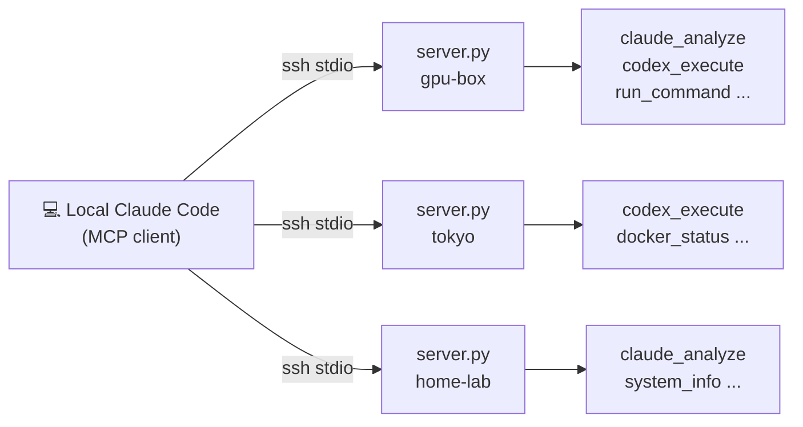
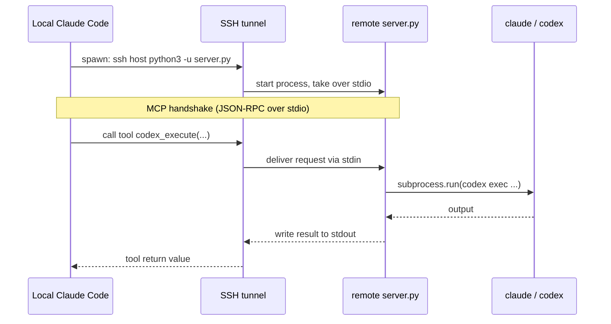
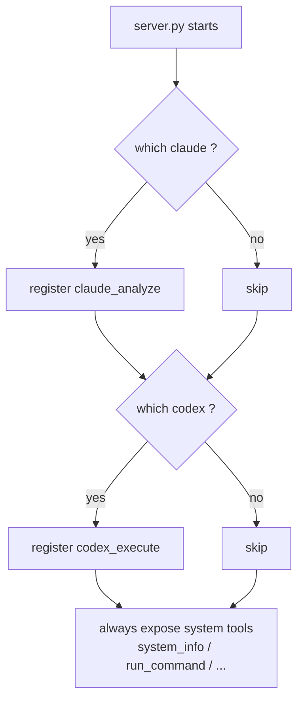
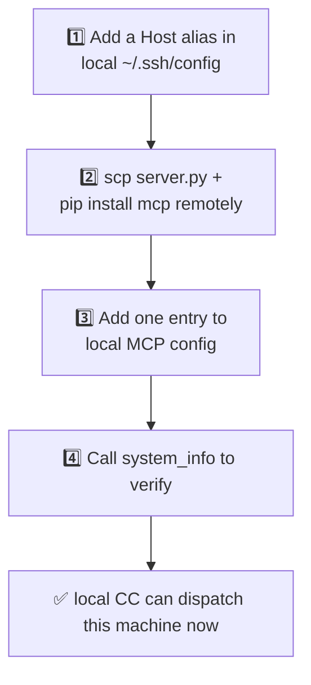

# Infinite Subagent

> Turn any number of remote servers into subagents for your local Claude Code.
> **One Python file. SSH-tunneled MCP. No ports, no HTTP server, no extra network config.**

**[中文](./README.md)** · [Tools](#-tools) · [Setup](#-one-time-setup) · [Add a server](#-add-a-new-server) · [Security](#-security)

---

## 🎯 The problem it solves

You have several machines — cloud boxes, a home GPU rig, overseas VPS — each with different AI CLIs installed (Claude Code, Codex). You want **one local Claude Code to command all of them**, dispatching tasks like subagents, in parallel — without wrestling with ports, firewalls, HTTPS, or token servers.

**The solution:** deploy a single `server.py` on each machine. It exposes MCP tools over an **SSH stdio channel**. Your local Claude Code just `ssh`es in; all MCP traffic stays inside the encrypted SSH tunnel.

```
In one line: if you can already ssh into a box, it can be your subagent now.
```

---

## 🏗️ Architecture



Same thing as a code diagram — each machine is its own SSH tunnel, independent and concurrent:

```
┌────────────────────────────────────────────────────────────────┐
│  Your laptop · local Claude Code                                │
│                                                                 │
│  MCP client, N servers registered (one per machine):            │
│    ├─ gpu-box   ──ssh──┐                                        │
│    ├─ tokyo      ──ssh──┼──▶  every box runs the same server.py │
│    └─ home-lab   ──ssh──┘     (MCP over stdio, JSON-RPC)        │
└────────────────────────────────────────────────────────────────┘
          │  encrypted SSH tunnel (requests → stdin, results → stdout)
          ▼
   ┌───────────────┐   ┌───────────────┐   ┌───────────────┐
   │   gpu-box     │   │     tokyo     │   │   home-lab    │
   │   server.py   │   │   server.py   │   │   server.py   │
   │  ├ claude ✓   │   │  ├ codex  ✓   │   │  ├ claude ✓   │
   │  └ codex  ✓   │   │  └ docker ✓   │   │  └ docker ✓   │
   │  auto-exposes │   │  auto-exposes │   │  auto-exposes │
   │  matching tools│   │  matching tools│   │  matching tools│
   └───────────────┘   └───────────────┘   └───────────────┘
```

---

## ⚙️ How it works

`server.py` uses the official Python `mcp` SDK with **stdio** as the transport. Your local MCP client spawns it via `ssh <host> python3 -u server.py`; every subsequent tool call is JSON-RPC passed back and forth over that single SSH connection.



**Capability auto-detection:** at startup the server runs `which claude / codex / docker` and exposes whatever is installed — the same file yields different tool sets on different machines.



---

## ✨ Designed for minimal config

This is the whole point: **once the one-time setup is done, everything else is handled by your local Claude Code.** You never log into a remote box again to change config.

```
   One-time setup (per machine, manual)        Add / dispatch (afterwards, all local)
 ┌─────────────────────────────┐      ┌──────────────────────────────────┐
 │ 1. ssh-keygen + ssh-copy-id │      │ ssh new-host 'pip install mcp'    │
 │ 2. scp server.py onto it    │      │ add one MCP client entry locally  │
 │ 3. pip install mcp          │      │ ── done ──                        │
 │ 4. (optional) drop fleet.env│      │ local CC can dispatch it instantly│
 └─────────────────────────────┘      └──────────────────────────────────┘
        once, scriptable      ─────────────────▶   zero remote touch daily
```

---

## 📦 Tools

Every machine exposes these **system tools**; on top of that it exposes **AI subagent tools** based on what it detects.

| Tool | Args | Description |
|---|---|---|
| `system_info` | — | CPU / memory / disk / OS / uptime / installed AI tools |
| `run_command` | `command`, `timeout?` | Run any shell command |
| `list_processes` | `filter?` | Process list (sorted by memory) |
| `read_file` | `path`, `lines?`, `offset?` | Read a file (≤10MB) |
| `write_file` | `path`, `content` | Write a file (whitelisted dirs only) |
| `check_service` | `name` | systemd service status |
| `restart_service` | `name` | Restart a systemd service |
| `docker_status` | — | Docker container status (if docker present) |
| `claude_analyze` | `prompt`, `workdir?` | **remote Claude Code subagent** (if claude present) |
| `codex_execute` | `task`, `workdir?` | **remote Codex subagent** (if codex present) |

---

## 🚀 One-time setup

Worked example: "local laptop + one remote host `myhost`". Fully general — repeat for as many machines as you like.

### 1. SSH trust (local → each machine)

```bash
# Dedicated key (skip if you already have one)
ssh-keygen -t ed25519 -f ~/.ssh/subagent_ed25519 -N ""

# Push the public key to each target
ssh-copy-id -i ~/.ssh/subagent_ed25519.pub user@myhost

# Add an alias (~/.ssh/config) so you only type myhost
cat >> ~/.ssh/config <<'EOF'
Host myhost
    Hostname 1.2.3.4           # your IP / domain / Tailscale address
    User ubuntu                # remote user
    IdentityFile ~/.ssh/subagent_ed25519
    IdentitiesOnly yes
    ServerAliveInterval 60
    ControlMaster auto         # reuse the connection, cuts per-call handshake
    ControlPath ~/.ssh/control-%r@%h:%p
    ControlPersist 10m
EOF
ssh myhost echo ok             # should print ok, no password prompt
```

> Public internet, LAN, Tailscale — all fine. **If `ssh myhost` works, the framework works.**

### 2. Deploy server.py to the remote machine

```bash
# Copy the script (any directory; example uses home)
scp server.py myhost:~/

# Install the dependency (official MCP SDK)
ssh myhost 'pip install --user mcp'

# Sanity check: it starts and self-reports
ssh myhost 'python3 -u ~/server.py'   # Ctrl+C to exit; a STARTUP log line means OK
```

### 3. (Optional) Headless auth for remote Claude Code

Only needed if this machine will act as a **Claude Code subagent** — so it can authenticate from a non-interactive SSH session:

```bash
# Create a real creds file from the example (fill in your token / gateway)
scp fleet.env.example myhost:~/.claude/fleet.env
ssh myhost 'nano ~/.claude/fleet.env'   # set ANTHROPIC_BASE_URL / ANTHROPIC_AUTH_TOKEN
```

`server.py` looks for creds in this order: `$FLEET_ENV_FILE` → `~/.claude/fleet.env` → `/etc/fleet/fleet.env` → `./fleet.env`. Any Anthropic-compatible endpoint works — official API, DeepSeek, etc.

> The Codex subagent doesn't need this file — it uses whatever codex login the machine already has.

### 4. Register the MCP server locally

Add this to your local Claude Code MCP config (`mcpServers` in `~/.claude.json`, or via `claude mcp add`):

```json
{
  "mcpServers": {
    "myhost-fleet": {
      "command": "ssh",
      "args": ["myhost", "python3", "-u", "~/server.py"]
    }
  }
}
```

Restart Claude Code and verify with one call:

```
myhost-fleet — system_info
```

If it returns that machine's system info, you're connected.

---

## ➕ Add a new server

Adding a machine is a **purely local operation** — existing machines are untouched. Three steps:



```bash
# ① SSH alias (same pattern as setup step 1)
# ② Deploy + install in one line
scp server.py newhost:~/ && ssh newhost 'pip install --user mcp'

# ③ Add one entry to local MCP config (name it anything, e.g. <alias>-fleet)
#    "newhost-fleet": { "command": "ssh", "args": ["newhost", "python3", "-u", "~/server.py"] }

# ④ Restart Claude Code, call newhost-fleet's system_info to verify
```

That's it. Adding the 2nd, 3rd, Nth machine is the identical flow — hence "infinite": **the framework makes zero assumptions about how many machines you have.**

---

## 🔒 Security

- **`fleet.env` contains real tokens — never commit it.** `.gitignore` excludes `*.env` and `fleet.env`; only the `fleet.env.example` placeholder is tracked.
- **End-to-end SSH encryption.** MCP traffic never leaves the SSH tunnel; no extra ports are opened.
- **`write_file` has a path whitelist** (`/tmp` `/home` `/root` `/etc/nginx` `/etc/systemd` `/usr/local` `/opt`) to avoid clobbering system paths by accident.
- **AI subagents have full permissions.** `claude_analyze` / `codex_execute` get complete filesystem access on their host — **only deploy to machines you trust.** Codex runs with `--dangerously-bypass-approvals-and-sandbox` for unattended execution, matching the Claude Code subagent's privilege level.
- **Key management.** Use a dedicated ed25519 key with `IdentitiesOnly yes`; never commit `~/.ssh/config`.

---

## 🧰 Requirements

- Remote machine: Python 3.10+, `pip install mcp` (the official [Model Context Protocol](https://modelcontextprotocol.io) Python SDK)
- Optional: `claude` (Claude Code CLI), `codex` (Codex CLI), `docker`
- Local: any client that speaks stdio MCP servers (Claude Code, Cline, etc.)

---

## 📄 License

MIT. It's one file — do whatever.
