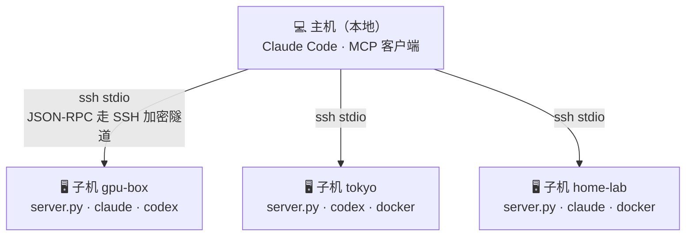
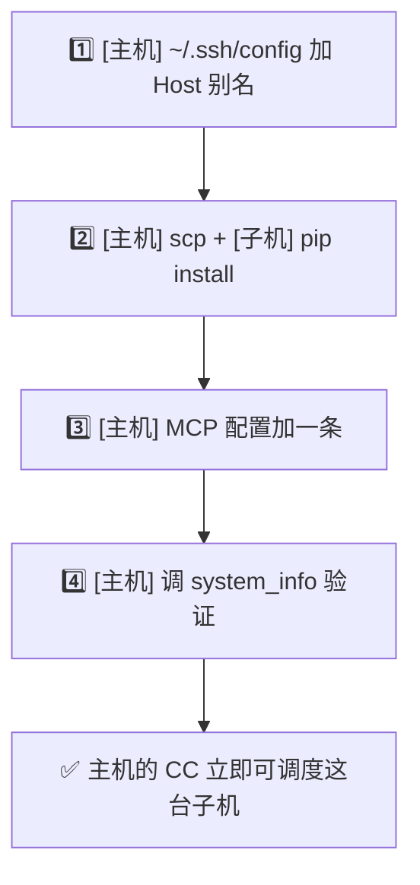
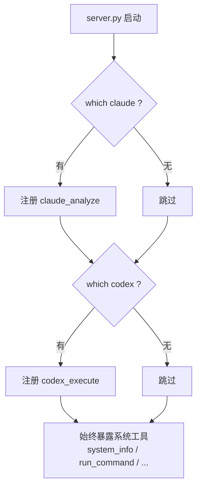
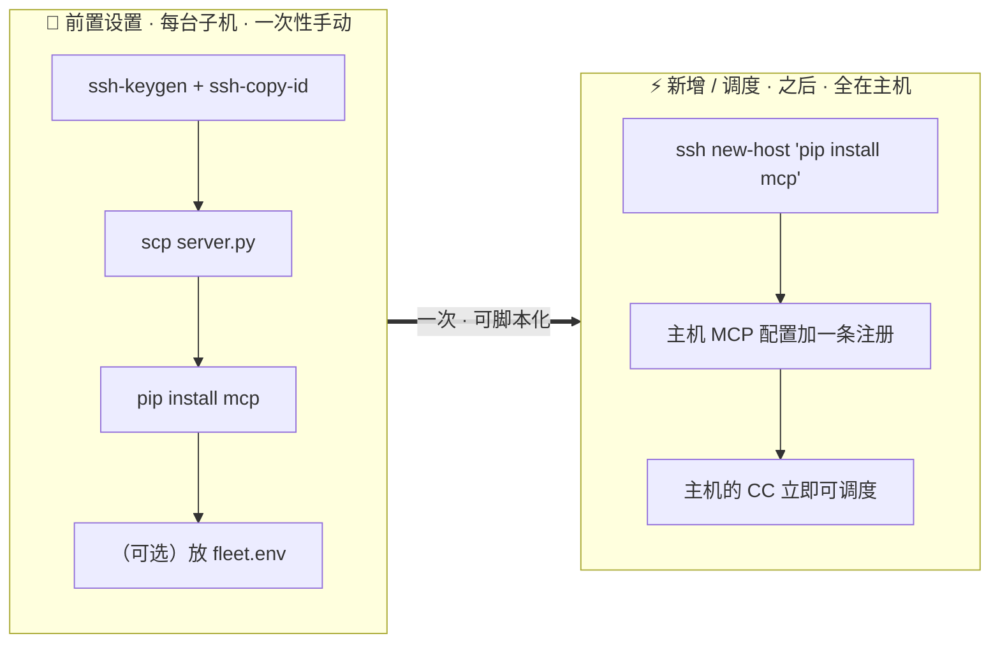
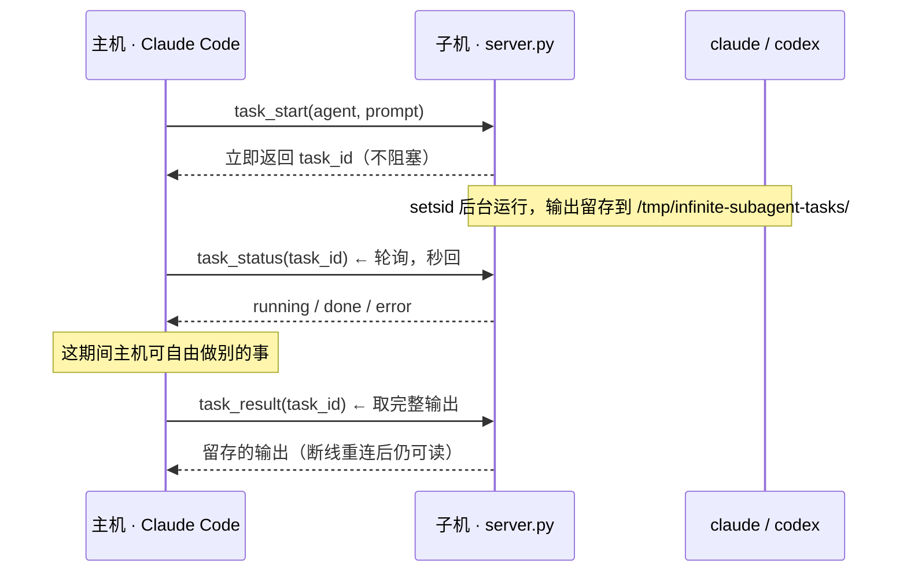

# Infinite Subagent

> 把任意数量的远程服务器，变成你本地 Claude Code 的子代理。**一次 SSH 配置，无限调度。**
> 整个框架只有一个 Python 文件，靠 SSH 隧道传 MCP，**不开任何端口、不跑任何 HTTP server**。

**[English](./README.en.md)** · [总架构](#-总架构) · [下载](#-下载你只需完成前置设置) · [新增子机](#-如何新增一台子机) · [工作原理](#️-工作原理) · [安全说明](#-安全说明) · [更新日志](#-更新日志)

**v1.1.0** · 2026-06-17

---

## 🎯 它有多好用？

你手上有好几台机器——云主机、家里的 GPU 箱、海外 VPS——上面装了不同的 AI 命令行（Claude Code、Codex）。你想让**本地一个 Claude Code 统领它们**，像调子代理一样并行调度，但不想折腾端口、防火墙、HTTPS、token server。

**Infinite Subagent 的解法：** 一个 `server.py` 部署到每台子机，通过 **SSH stdio 通道**暴露 MCP 工具。主机只管 `ssh` 进去，MCP 流量全程在 SSH 加密隧道里。

---

## 🏗️ 总架构



每条都是独立的 SSH 隧道，互不干扰、可并发；同一份 `server.py` 跑在不同子机上，按本机装了什么自动暴露不同工具集。配置怎么落地，见下方。

---

## 🚀 下载：你只需完成前置设置

- **主机 / Host**：你**本地**的机器，运行 Claude Code，是**调度方**。
- **子机 / Sub**：被调度的**远程**服务器，运行 `server.py`，是**被调度方**。

以「主机 + 一台子机 `myhost`」为例，泛化到任意台。

### 1. SSH 互信（主机 → 子机）

```bash
# [主机] 生成专用密钥（已有可跳过）
ssh-keygen -t ed25519 -f ~/.ssh/subagent_ed25519 -N ""

# [主机] 把公钥推到子机（会让你输一次子机密码）
ssh-copy-id -i ~/.ssh/subagent_ed25519.pub user@myhost

# [主机] 写入 ~/.ssh/config，之后只敲 myhost
cat >> ~/.ssh/config <<'EOF'
Host myhost
    Hostname 1.2.3.4           # 子机的 IP / 域名 / Tailscale 地址
    User ubuntu                # 子机的登录用户名
    IdentityFile ~/.ssh/subagent_ed25519
    IdentitiesOnly yes
    ServerAliveInterval 60
    ControlMaster auto         # 复用连接，降低每次调用的握手开销
    ControlPath ~/.ssh/control-%r@%h:%p
    ControlPersist 10m
EOF
# [主机] 验证免密登录（应直接回 ok，不再问密码）
ssh myhost echo ok
```

> 公网、内网、Tailscale 都行——只要 `ssh myhost` 能进，框架就能用。

### 2. 在子机上部署 server.py

```bash
# [主机] 把脚本推到子机
scp server.py myhost:~/

# [子机]（经 ssh 远程执行）装依赖 —— 官方 MCP SDK
ssh myhost 'pip install --user mcp'

# [子机] 验证脚本能起、能自检（Ctrl+C 退出，看到 STARTUP 日志即正常）
ssh myhost 'python3 -u ~/server.py'
```

### 3.（可选）子机的 Claude Code 无头认证

仅当这台子机要当 **Claude Code 子代理**时才需要，让它在非交互的 SSH 环境里也能通过认证：

```bash
# [主机] 用示例文件在子机上建一份凭证
scp fleet.env.example myhost:~/.claude/fleet.env

# [子机] 填入你自己的 token / 网关地址
ssh myhost 'nano ~/.claude/fleet.env'   # 设 ANTHROPIC_BASE_URL / ANTHROPIC_AUTH_TOKEN
```

`server.py` 找凭证的顺序：`$FLEET_ENV_FILE` → `~/.claude/fleet.env` → `/etc/fleet/fleet.env` → `./fleet.env`。官方 API、DeepSeek 等任何 Anthropic 兼容端点都行。Codex 子代理不需要这个文件——它用机器上已有的 codex 登录态。

### 4. 在主机注册 MCP server

```bash
# [主机] 注册到 user scope（所有目录都能用，推荐）
claude mcp add -s user myhost-fleet -- ssh myhost python3 -u ~/server.py
```

等价的手动写法（`~/.claude.json` 的 `mcpServers`）：

```json
{
  "mcpServers": {
    "myhost-fleet": {
      "command": "ssh",
      "args": ["myhost", "python3", "-u", "~/server.py"]
    }
  }
}
```

重启 Claude Code，调一次验证：

```
myhost-fleet — system_info
```

返回子机的系统信息，就通了。

---

## 🔄 更新：同步到最新版

仓库：[github.com/hashiruu/infinite-subagent](https://github.com/hashiruu/infinite-subagent)

有新版时，一行命令同步到子机：

```bash
# 下载最新 server.py 推到子机，覆盖旧版即可
scp server.py myhost:~/
```

然后在主机 `/mcp` 重连即生效。全部子机都一样。

---

## ➕ 如何新增一台子机

纯**主机**操作，已有子机不受影响。每条同样标位置：



```bash
# ① [主机] 加 SSH 别名（同前置设置第 1 步写法）
# ② [主机] 推脚本 + [子机] 装依赖，一行搞定
scp server.py newhost:~/ && ssh newhost 'pip install --user mcp'
# ③ [主机] 注册（名字随你起，建议 <别名>-fleet）
claude mcp add -s user newhost-fleet -- ssh newhost python3 -u ~/server.py
# ④ [主机] 重启 CC，调 newhost-fleet 的 system_info 验证
```

新增第 2、3、…、N 台流程完全一样——这就是「无限」的由来：**框架对你的机器数量没有任何限制**。

---

## ⚙️ 工作原理

`server.py` 用官方 Python `mcp` SDK，以 **stdio** 为传输层。主机通过 `ssh <子机> python3 -u server.py` 把它拉起，后续所有工具调用都在这条 SSH 连接里来回传 JSON-RPC。


**能力自检：** server 启动时 `which claude / codex / docker`，装了什么就暴露什么——同一份代码跑在不同子机上，工具集自动不同。



---

## ✨ 少配置

**前置设置做完，之后一切由主机上的 Claude Code 解决**，你不用再登子机改配置。



---

## 📦 工具清单

每台子机都会暴露下面这些**系统工具**；此外按检测结果额外暴露 **AI 子代理工具**。

| 工具 | 参数 | 说明 |
|---|---|---|
| `system_info` | — | CPU / 内存 / 磁盘 / OS / uptime / 已装的 AI 工具 |
| `run_command` | `command`, `timeout?` | 执行任意 shell 命令 |
| `list_processes` | `filter?` | 进程列表（按内存排序） |
| `read_file` | `path`, `lines?`, `offset?` | 读文件（≤10MB） |
| `write_file` | `path`, `content` | 写文件（仅限白名单目录） |
| `check_service` | `name` | systemd 服务状态 |
| `restart_service` | `name` | 重启 systemd 服务 |
| `docker_status` | — | Docker 容器状态（装了才有） |
| `claude_analyze` | `prompt`, `workdir?` | 远程 Claude Code 子代理·**同步**（装了 claude 才有） |
| `codex_execute` | `task`, `workdir?` | 远程 Codex 子代理·**同步**（装了 codex 才有） |
| `task_start` | `agent`, `prompt`, `workdir?`, `timeout?` | 后台启动一个 claude/codex **长任务**，立即返回 task_id（不阻塞调用方） |
| `task_status` | `task_id` | 轮询任务状态（running/done/error/gone），秒回 |
| `task_result` | `task_id`, `max_bytes?` | 拉取任务完整输出（断线重连后仍可读） |
| `task_list` | — | 列出本机所有后台任务（含历史会话，用于断线续跑） |

---

## 🧩 异步任务：长任务不阻塞、断线可续

`claude_analyze` / `codex_execute` 是**同步**的——调用即阻塞，直到子代理跑完（最长 300s）才返回。短任务够用，但有两个硬伤：

1. **主机被钉死**：一次远程 AI 任务要干等最多 5 分钟，期间 MCP 客户端干不了别的。
2. **断线即丢**：SSH/MCP 一断，正在跑的输出直接丢失，只能重头再来。

`task_start` 系列改成**异步 job**——长任务交给它们：



**怎么用**：任何可能跑久的任务，用 `task_start(agent="claude"|"codex", prompt=...)` 替代 `claude_analyze`/`codex_execute`，拿到 `task_id` 后去忙别的，回头 `task_status` 轮询到 `done`，再 `task_result` 取结果。

**断线续跑**：输出写在子机磁盘（`/tmp/infinite-subagent-tasks/<task_id>/`），与 MCP 连接无关。即使中途 SSH 断开、重连、甚至换了会话，`task_list` 仍能看到所有历史任务，`task_result` 仍能拉回结果——长任务不再因断线白跑。

> 同步工具（`claude_analyze`/`codex_execute`）保留不动，适合「调一下就要结果」的短任务；长任务一律走 `task_*`。

---

## 🔒 安全说明

- **全程 SSH 加密。** MCP 流量不离开 SSH 隧道，不额外开端口。
- **`write_file` 有路径白名单**（`/tmp` `/home` `/root` `/etc/nginx` `/etc/systemd` `/usr/local` `/opt`），避免误写系统关键路径。
- **AI 子代理拥有完整权限。** `claude_analyze` / `codex_execute` 在子机上有完全的文件系统访问权——**只部署到你信任的节点**。Codex 用 `--dangerously-bypass-approvals-and-sandbox` 以便无头执行，这与 Claude Code 子代理的权限对等。
- **密钥管理。** 用专用 ed25519 密钥 + `IdentitiesOnly yes`，`~/.ssh/config` 不要入库。

---

## 🧰 依赖

- 子机：Python 3.10+，`pip install mcp`（官方 [Model Context Protocol](https://modelcontextprotocol.io) Python SDK）
- 可选：`claude`（Claude Code CLI）、`codex`（Codex CLI）、`docker`
- 主机：任何支持 stdio MCP server 的客户端（Claude Code、Cline 等）

---

## 📄 许可证

MIT。一个文件，随便用。

---

## 📋 更新日志

### v1.1.0 — 2026-06-17
- **新增异步任务模型**：`task_start` / `task_status` / `task_result` / `task_list`——长任务后台运行不阻塞调用方，输出留存支持断线续跑
- 安全：`setsid` 进程组（超时 watchdog 杀整组）、0600 env 文件（密钥不入 `ps` argv）、`exit_code` 文件做可信完成检测
- 同步 `claude_analyze` / `codex_execute` 保留作短任务

### v1.0.0
- 初始版本：单文件 SSH-tunneled MCP，系统工具 + claude/codex 子代理，零端口零 HTTP
