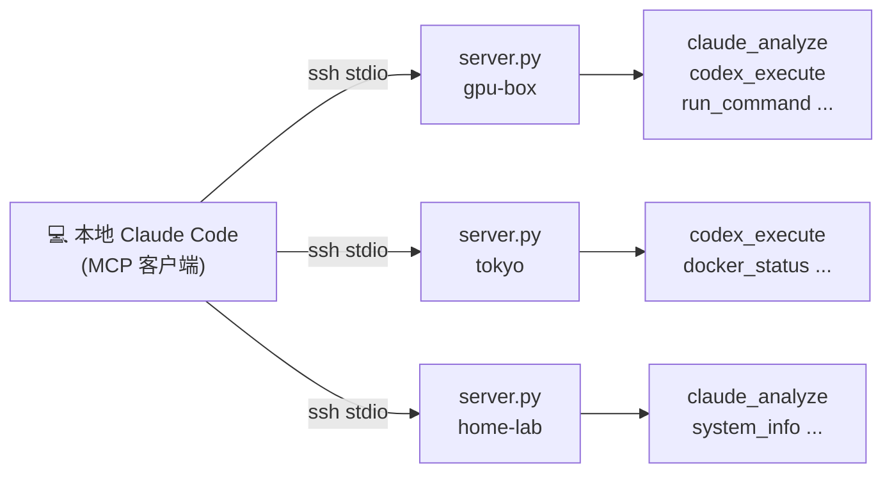
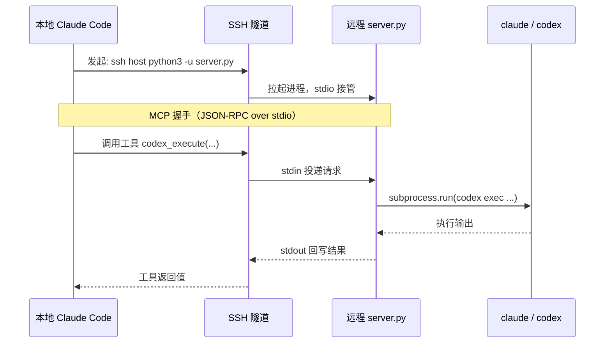
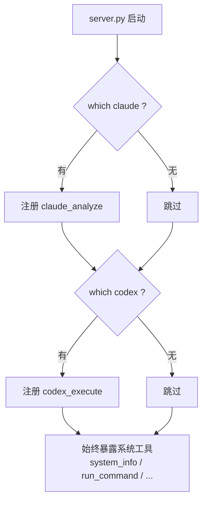
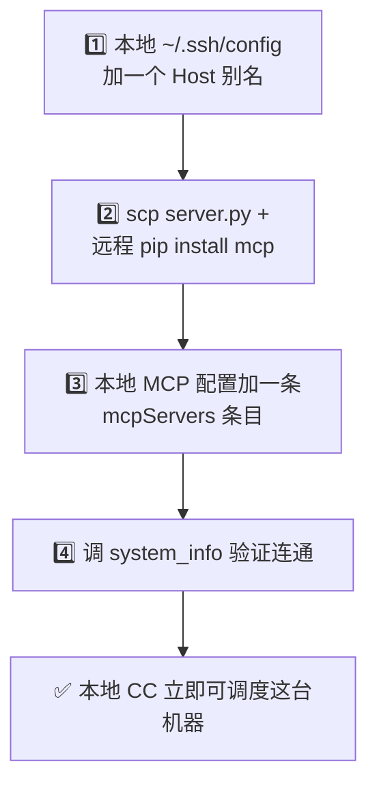

# Infinite Subagent

> 把任意数量的远程服务器，变成你本地 Claude Code 的子代理。**一次 SSH 配置，无限调度。**
> 整个框架只有一个 Python 文件，靠 SSH 隧道传 MCP，**不开任何端口、不跑任何 HTTP server**。

**[English](./README.en.md)** · [工具清单](#-工具清单) · [前置设置](#-前置设置一次性) · [新增服务器](#-如何新增一台服务器) · [安全说明](#-安全说明)

---

## 🎯 解决什么痛点

你手上有好几台机器——云主机、家里的 GPU 箱、海外 VPS——上面装了不同的 AI 命令行（Claude Code、Codex）。你想让**本地一个 Claude Code 统领它们**，像调子代理一样并行调度，但不想折腾端口、防火墙、HTTPS、token server。

**Infinite Subagent 的解法：** 一个 `server.py` 部署到每台机器，通过 **SSH stdio 通道**暴露 MCP 工具。本地 Claude Code 只管 `ssh` 进去，MCP 流量全程在 SSH 加密隧道里。

```
一句话：你已经能 ssh 进去的机器，现在就能让它当你的子代理。
```

---

## 🏗️ 整体架构



代码视角看同一件事——每一台机器都是一条独立的 SSH 隧道，互不干扰、可并发：

```
┌────────────────────────────────────────────────────────────────┐
│  你的笔记本 · 本地 Claude Code                                   │
│                                                                 │
│  MCP 客户端，注册了 N 个 server（每台机器一条）：                 │
│    ├─ gpu-box   ──ssh──┐                                        │
│    ├─ tokyo      ──ssh──┼──▶  每台都跑同一个 server.py            │
│    └─ home-lab   ──ssh──┘     (MCP over stdio，JSON-RPC)         │
└────────────────────────────────────────────────────────────────┘
          │  SSH 加密隧道（命令走 stdin，结果回 stdout）
          ▼
   ┌───────────────┐   ┌───────────────┐   ┌───────────────┐
   │   gpu-box     │   │     tokyo     │   │   home-lab    │
   │   server.py   │   │   server.py   │   │   server.py   │
   │  ├ claude ✓   │   │  ├ codex  ✓   │   │  ├ claude ✓   │
   │  └ codex  ✓   │   │  └ docker ✓   │   │  └ docker ✓   │
   │  自动暴露对应  │   │  自动暴露对应  │   │  自动暴露对应  │
   │  的 MCP 工具   │   │  的 MCP 工具   │   │  的 MCP 工具   │
   └───────────────┘   └───────────────┘   └───────────────┘
```

---

## ⚙️ 工作原理

`server.py` 用官方 Python `mcp` SDK，以 **stdio** 为传输层。本地 MCP 客户端通过 `ssh <host> python3 -u server.py` 把它拉起来，后续所有工具调用都是在这条 SSH 连接里来回传 JSON-RPC。



**能力自检：** server 启动时 `which claude / codex / docker`，装了什么就暴露什么——同一份代码跑在不同机器上，工具集自动不同。



---

## ✨ 主打：少配置

这是整个框架的设计宗旨——**前置设置做完，之后一切由本地 Claude Code 解决**，你不用再登远程机器改配置。

```
   前置设置（每台机器，一次性手动）           新增 / 调度（之后，全本地）
 ┌─────────────────────────────┐      ┌──────────────────────────────────┐
 │ 1. ssh-keygen + ssh-copy-id  │      │ ssh new-host 'pip install mcp'    │
 │ 2. scp server.py 上去         │      │ 本地 MCP 客户端加一条注册          │
 │ 3. pip install mcp           │      │ ── 完事 ──                        │
 │ 4.（可选）放 fleet.env        │      │ 本地 CC 立刻能并行调度这台机器      │
 └─────────────────────────────┘      └──────────────────────────────────┘
        一次性、可脚本化   ─────────────────▶   日常零接触远程
```

---

## 📦 工具清单

每台机器都会暴露下面这些**系统工具**；此外按检测结果额外暴露 **AI 子代理工具**。

| 工具 | 参数 | 说明 |
|---|---|---|
| `system_info` | — | CPU / 内存 / 磁盘 / OS / uptime / 已装的 AI 工具 |
| `run_command` | `command`, `timeout?` | 执行任意 shell 命令 |
| `list_processes` | `filter?` | 进程列表（按内存排序） |
| `read_file` | `path`, `lines?`, `offset?` | 读文件（≤10MB） |
| `write_file` | `path`, `content` | 写文件（仅限白名单目录） |
| `check_service` | `name` | systemd 服务状态 |
| `restart_service` | `name` | 重启 systemd 服务 |
| `docker_status` | — | Docker 容器状态（装了才有） |
| `claude_analyze` | `prompt`, `workdir?` | **远程 Claude Code 子代理**（装了 claude 才有） |
| `codex_execute` | `task`, `workdir?` | **远程 Codex 子代理**（装了 codex 才有） |

---

## 🚀 前置设置（一次性）

下面以「本地 + 一台远程主机 `myhost`」为例。完整可复现，泛化到任意台机器。

### 1. SSH 互信（本地 → 每台机器）

```bash
# 本地生成专用密钥（已有可跳过）
ssh-keygen -t ed25519 -f ~/.ssh/subagent_ed25519 -N ""

# 把公钥推到每台目标机器
ssh-copy-id -i ~/.ssh/subagent_ed25519.pub user@myhost

# 配置别名（~/.ssh/config），之后只敲 myhost
cat >> ~/.ssh/config <<'EOF'
Host myhost
    Hostname 1.2.3.4           # 改成你的 IP / 域名 / Tailscale 地址
    User ubuntu                # 改成远程用户名
    IdentityFile ~/.ssh/subagent_ed25519
    IdentitiesOnly yes
    ServerAliveInterval 60
    ControlMaster auto         # 复用连接，降低每次调用的握手开销
    ControlPath ~/.ssh/control-%r@%h:%p
    ControlPersist 10m
EOF
ssh myhost echo ok             # 应直接回 ok，不再问密码
```

> 公网、内网、Tailscale 都行——**只要 `ssh myhost` 能进，框架就能用**。

### 2. 部署 server.py 到远程机器

```bash
# 推脚本上去（任意目录，下例放在用户家目录）
scp server.py myhost:~/

# 远程装依赖（官方 MCP SDK）
ssh myhost 'pip install --user mcp'

# 验证脚本能起、能自检
ssh myhost 'python3 -u ~/server.py'   # Ctrl+C 退出，看到 STARTUP 日志即正常
```

### 3.（可选）配置远程 Claude Code 的无头认证

只有当这台机器要当 **Claude Code 子代理**时才需要。让它在非交互的 SSH 环境里也能通过认证：

```bash
# 用示例文件建一份真实凭证（填你自己的 token / 网关地址）
scp fleet.env.example myhost:~/.claude/fleet.env
ssh myhost 'nano ~/.claude/fleet.env'   # 填入 ANTHROPIC_BASE_URL / ANTHROPIC_AUTH_TOKEN
```

`server.py` 会按这个顺序找凭证：`$FLEET_ENV_FILE` → `~/.claude/fleet.env` → `/etc/fleet/fleet.env` → `./fleet.env`。官方 API、DeepSeek 等任何 Anthropic 兼容端点都行。

> Codex 子代理不需要这个文件——它用机器上已有的 codex 登录态。

### 4. 本地注册 MCP server

把这条加到你本地 Claude Code 的 MCP 配置（`~/.claude.json` 的 `mcpServers`，或用 `claude mcp add`）：

```json
{
  "mcpServers": {
    "myhost-fleet": {
      "command": "ssh",
      "args": ["myhost", "python3", "-u", "~/server.py"]
    }
  }
}
```

重启 Claude Code，然后调一次验证：

```
myhost-fleet — system_info
```

返回这台机器的系统信息，就通了。

---

## ➕ 如何新增一台服务器

新增一台是**纯本地操作**，不用碰已有机器。三步：



```bash
# ① 加 SSH 别名（见上方前置设置第 1 步的同款写法）
# ② 部署 + 装依赖（一行搞定）
scp server.py newhost:~/ && ssh newhost 'pip install --user mcp'

# ③ 本地 MCP 配置加一条（名字随你起，建议 <别名>-fleet）
#    "newhost-fleet": { "command": "ssh", "args": ["newhost", "python3", "-u", "~/server.py"] }

# ④ 重启 Claude Code，调 newhost-fleet 的 system_info 验证
```

就这些。新增第 2、第 3、第 N 台完全一样的流程——这就是「无限」的由来：**框架对你的机器数量没有任何假设**。

---

## 🔒 安全说明

- **`fleet.env` 含真实 token，绝不入库。** 仓库 `.gitignore` 已排除 `*.env`、`fleet.env`，只保留 `fleet.env.example` 占位文件。
- **全程 SSH 加密。** MCP 流量不离开 SSH 隧道，不额外开端口。
- **`write_file` 有路径白名单**（`/tmp` `/home` `/root` `/etc/nginx` `/etc/systemd` `/usr/local` `/opt`），避免误写系统关键路径。
- **AI 子代理拥有完整权限。** `claude_analyze` / `codex_execute` 在该机器上有完全的文件系统访问权——**只部署到你信任的节点**。Codex 用 `--dangerously-bypass-approvals-and-sandbox` 以便无头执行，这与 Claude Code 子代理的权限对等。
- **密钥管理。** 用专用 ed25519 密钥 + `IdentitiesOnly yes`，`~/.ssh/config` 不要入库。

---

## 🧰 依赖

- 远程机器：Python 3.10+，`pip install mcp`（官方 [Model Context Protocol](https://modelcontextprotocol.io) Python SDK）
- 可选：`claude`（Claude Code CLI）、`codex`（Codex CLI）、`docker`
- 本地：任何支持 stdio MCP server 的客户端（Claude Code、Cline 等）

---

## 📄 许可证

MIT。一个文件，随便用。
